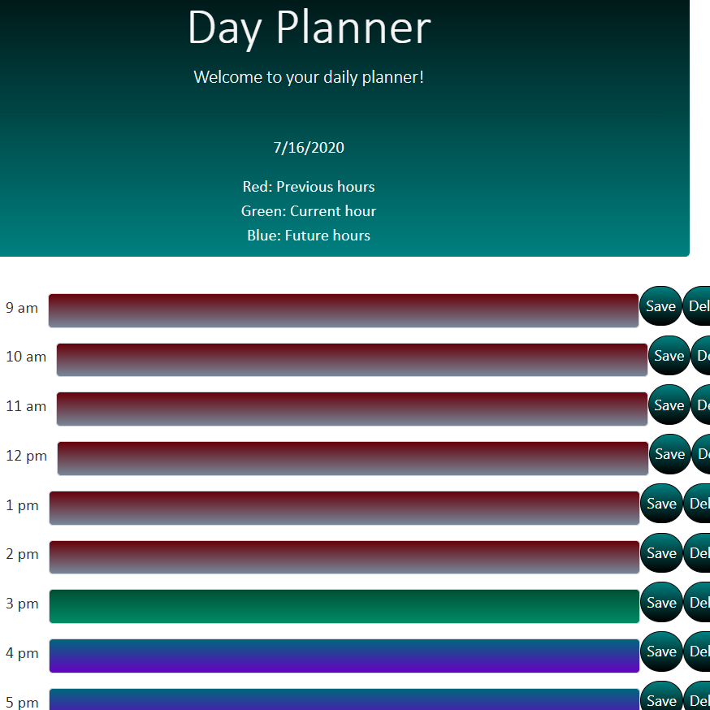

# Weather Dashboard
> The day planner is an HTML document powered by CSS and Jquery to be able to log a users input for each hour and save it.

## Description
This is the perfect planner to log in your hourly tasks

The background colors of the input boxes are all different for the past, present, and future

## Screenshot(s)

## Development setup

Clone the repo to your local machine. Run the browser.

## Meta

Nicholas Finch
nicfinch223@gmail.com

[https://github.com/finch23](https://github.com/finch23)

## Contributing
>Feel free to fork this repo and add your own creative design!

1. Fork it (<https://github.com/yourname/yourproject/fork>)
2. Create your feature branch (`git checkout -b feature/fooBar`)
3. Commit your changes (`git commit -am 'Add some fooBar'`)
4. Push to the branch (`git push origin feature/fooBar`)
5. Create a new Pull Request
